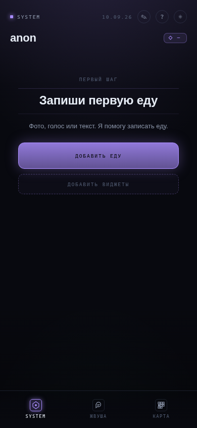
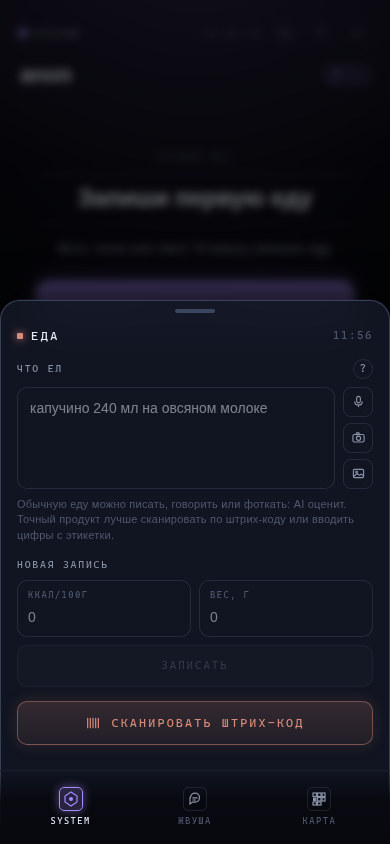

# Жвуша — AI-дневник питания в Telegram

**Pet-проект:** счётчик калорий в формате Telegram Mini App. Еду можно добавить текстом, фотографией, голосом или по штрих-коду. Приложение помогает вести дневник, считать калории и БЖУ, а результат AI можно проверить и исправить перед сохранением.

Проект объединяет разработку интерфейса, интеграцию мультимодальных моделей и работу с пользовательскими данными. Основной интерес — пройти весь путь от ввода еды до сохранённой записи: с понятным источником расчёта, обработкой ошибок и контролем данных.

[](https://github.com/KoTTiH/zhvusha-miniapp/actions/workflows/quality.yml)

## Интерфейс

<p>
  
  
</p>

Настоящие скриншоты локально запущенного приложения: первый экран и форма добавления еды. Результаты распознавания на них не показаны.

## Что умеет приложение

- **Запись еды:** текст, фото, голос, сканирование штрих-кода и ручной ввод.
- **Прозрачный расчёт:** калории, белки, жиры, углеводы и клетчатка; источник данных, уверенность AI и уточнение порции.
- **Дневник:** календарь питания, вода, заметки, собственные продукты и шаблоны блюд.
- **Быстрый ввод:** недавние продукты, повторение записей и разбор всего дня из одного сообщения.
- **Личная главная:** виджеты калорий и воды. Виджеты не включаются скрытым дефолтом — пользователь выбирает их сам.
- **Жвуша:** AI-советник по дневнику с автоматическим контекстом недавних записей, подтверждаемой памятью и фотографиями по согласию пользователя.
- **Перенос данных:** экспорт в JSON, предварительный просмотр импорта и проверка целостности.

## Статус и ограничения

Это развивающийся pet-проект для практики и экспериментов. В репозитории есть клиент, API, миграции базы, проверки и конфигурация сборки для Vercel.

AI-оценка порции и состава может ошибаться. Название бренда в тексте само по себе не подтверждает точный состав продукта; результат стоит сверять с этикеткой и корректировать вручную. Оценка уверенности модели не является измеренной точностью распознавания.

Ручной дневник доступен в обычном браузере без ключей. Для AI и серверного хранения нужны собственные настройки провайдеров. Интеграция AI-кредитов и Tribute присутствует в коде как часть эксперимента с монетизацией; репозиторий не обещает готовность к коммерческому запуску.

## Стек

| Часть | Технологии |
| --- | --- |
| Интерфейс | React 19, TypeScript 6 в strict-режиме, Vite 8 |
| Состояние и стили | Zustand, Tailwind CSS 4, собственные дизайн-токены |
| Telegram | `@tma.js/sdk-react`, темы, initData, CloudStorage |
| API | TypeScript, Vercel Functions |
| AI | OpenRouter: разбор текста, изображений и транскрипция аудио |
| Хранение | PostgreSQL, Telegram CloudStorage, localStorage |
| Фотографии советника | Vercel Blob Private |
| Штрих-коды | ZXing, Open Food Facts, локальные карточки продуктов |
| Проверки | TypeScript, ESLint, контрактные скрипты, GitHub Actions |

## Запуск локально

Нужны Node.js 22.18+ и pnpm 10. Проверки напрямую импортируют TypeScript, поэтому важна поддержка type stripping в Node.js. Версии зависимостей зафиксированы в `pnpm-lock.yaml`.

```bash
git clone https://github.com/KoTTiH/zhvusha-miniapp.git
cd zhvusha-miniapp
pnpm install --frozen-lockfile
pnpm dev
```

Открой `http://localhost:5173`. В обычном браузере ручные записи сохраняются в localStorage; для этого Telegram и AI-ключ не нужны. Локальные API-маршруты обслуживает плагин в `vite.config.ts`.

### Подключение AI и сервера

Скопируй шаблон и заполни только нужные параметры:

```bash
cp .env.local.example .env.local
```

Неиспользуемые необязательные параметры оставь пустыми. Без `BLOB_READ_WRITE_TOKEN` байты фотографий советника в локальном режиме хранятся в памяти процесса и исчезают после перезапуска. Метаданные всё равно записываются в PostgreSQL: фото советника без базы не работают. Для постоянного хранения самих файлов нужен собственный приватный Blob store.

| Переменная | Назначение |
| --- | --- |
| `OPENROUTER_API_KEY` | Серверный ключ AI-провайдера |
| `DATABASE_URL` | Подключение к собственной базе PostgreSQL |
| `TELEGRAM_BOT_TOKEN` | Проверка Telegram initData на сервере |
| `BLOB_READ_WRITE_TOKEN` | Необязательное приватное хранилище фотографий советника |
| `ALLOW_UNAUTH=1` | Явный локальный режим разработки без Telegram; на Vercel обход отключён |
| `TRIBUTE_*` | Необязательные настройки интеграции платежей |

PostgreSQL нужен для учёта AI-кредитов, постоянной истории и памяти советника, а также для его фотографий. Текстовый советник без базы в локальном режиме работает временно, без сохранения истории и памяти. Перед миграцией проверь, что `DATABASE_URL` указывает на нужную базу, затем выполни:

```bash
pnpm db:migrate
pnpm dev
```

Файл `.env.local` остаётся только на твоём компьютере. Серверные ключи нельзя помещать в переменные `VITE_*`: они доступны клиенту.

Для Telegram требуется HTTPS-адрес Mini App и собственный бот. При размещении на Vercel используются `vercel.json` и функции из `api/`; секреты задаются в окружении проекта. Репозиторий не содержит привязки к чужому аккаунту или готовых ключей.

## Как устроен проект

```text
src/
  components/       формы ввода, дневник, настройки, виджеты
  screens/          основные экраны и AI-советник
  store/            состояние Zustand
  lib/              AI-клиент, хранение, импорт и экспорт
  design/           тема и компоненты интерфейса
api/
  _lib/             провайдер, авторизация, база, AI-кредиты
  *.ts              серверные маршруты
db/migrations/      SQL-схема и её изменения
scripts/            контрактные проверки и browser-smoke
ai/qa/              настройки допустимых источников AI-поиска
docs/               проверяемые сценарии и правила CI
```

Путь записи еды: форма → серверный разбор → редактируемый результат → Zustand → адаптер хранения. ID моделей вынесены в [`api/_lib/modelIds.ts`](api/_lib/modelIds.ts).

Основные маршруты:

| Маршрут | Задача |
| --- | --- |
| `POST /api/parse-food` | Разобрать еду из текста или изображений, уточнить результат |
| `POST /api/parse-day` | Разобрать еду, воду и заметки за день |
| `POST /api/transcribe-audio` | Преобразовать голос в текст |
| `POST /api/calorie-storage` | Сохранить дневник еды, продукты, блюда и цель |
| `POST /api/note-storage` | Сохранить заметки |
| `POST /api/assistant-chat` | Ответ советника с автоматически добавленным контекстом дневника |
| `POST /api/assistant-attachment` | Загрузить, получить или удалить фото советника |

### Где хранятся данные

Режимы: Postgres / Telegram CloudStorage / localStorage. В Telegram основное серверное хранилище — Postgres; адаптеры поддерживают fallback и перенос старых данных. В обычном браузере используется localStorage. Панель хранения во вкладке «данные» показывает режим и не показывает сырой Telegram id.

### AI и данные

AI получает отправленные пользователем текст, голос и фото. При сообщении советнику приложение автоматически добавляет выбранный день и недавние записи еды, воды и заметок; сервер может дополнить их дневником за последние 30 дней, историей диалога и подтверждённой памятью. Отдельного выбора всех передаваемых записей перед отправкой сейчас нет. Фотографии пользователь выбирает отдельно. После успешного разбора сохраняются текст запроса, результат и сведения о модели. Сырые фото не пишутся в журнал AI-анализов: в истории остаётся результат распознавания.

Для советника сохраняются сообщения и рабочее состояние текущего треда. Долгая память подтверждается пользователем, а фотографии по отдельному согласию хранятся в Vercel Blob Private. Общий текст правил — [`src/lib/aiPrivacyPolicy.ts`](src/lib/aiPrivacyPolicy.ts).

### Экспорт данных и восстановление

Экспорт данных создаёт JSON с дневником и настройками. Интерфейс показывает последний экспорт, fingerprint и короткий код копии для сверки файла.

Восстановление из JSON сначала проверяет файл и показывает состав, затем применяет импорт после отдельного действия пользователя. Записи объединяются с текущими данными. «Целостность данных» ищет битые ссылки между записями, продуктами и блюдами.

### AI-кредиты

Правила текущей реализации:

- Один первичный ввод еды или быстрый ввод всего дня стоит 1 AI-кредит.
- Уточнения результата, транскрипция аудио, Жвуша-советник, исправления, календарь, заметки и ручной ввод бесплатны.
- Если AI не вернул пригодный результат, списанный AI-кредит возвращается.

Под «бесплатно» здесь понимается отсутствие списания внутренних кредитов; обращения к провайдеру могут иметь стоимость для владельца приложения. Правила интерфейса собраны в [`src/lib/aiCreditPolicy.ts`](src/lib/aiCreditPolicy.ts).

## Проверки

Запускай проверки последовательно:

```bash
pnpm check
pnpm build
pnpm bundle:check
```

`pnpm check` включает типизацию, линтер и контрактные проверки. CI выполняет ту же цепочку. Нормализация штрих-кодов проверяется без платного AI. Контрактные проверки фиксируют отдельные инварианты кода и документации и не заменяют проверку пользовательского сценария.

| Область | Команда |
| --- | --- |
| Типизация и стиль | `pnpm typecheck`, `pnpm lint` |
| Штрих-коды и ввод дня | `pnpm barcode:check`, `pnpm day-voice:check` |
| Источник оценки и продуктовые ограничения | `pnpm nutrition:check`, `pnpm philosophy:check` |
| AI-кредиты, данные и советник | `pnpm ai-credit:check`, `pnpm ai-privacy:check`, `pnpm assistant:check` |
| Хранилище и перенос данных | `pnpm storage-status:check`, `pnpm data-export:check` |
| Диагностика | `pnpm app-readiness:check`, `pnpm quality-map:check` |
| Главная и доступность | `pnpm widgets:check`, `pnpm accessibility:check` |
| Поиск и конфигурация CI | `pnpm ai:search-whitelist:check`, `pnpm quality-gate:check` |

Для проверки интерфейса предусмотрены отдельные browser-smoke: `pnpm smoke:smart-history`, `pnpm smoke:data-export`, `pnpm smoke:accessibility`. Они используют Chromium и отдельный тестовый профиль; в CI эти задания необязательные.

<details>
<summary>Диагностика и доступность интерфейса</summary>

### Паспорт готовности

В режиме разработки панель проверяет локальный контекст без AI, без сетевых запросов и без записи данных. Она также сверяет последний экспорт и импорт по коду. Это локальная диагностика, а не подтверждение готовности сервера к эксплуатации.

### Карта проверок

Карта — read-only справка о проверках: browser-smoke, `pnpm bundle:check`, `pnpm accessibility:check` и `pnpm smoke:accessibility`. Команды в панели не запускаются из браузера, а сама панель не подтверждает, что они прошли.

### Диалоги и клавиатура

Для диалогов предусмотрены удержание фокуса, закрытие по Escape и возврат фокуса к исходному элементу. Виджеты поддерживают настройку с клавиатуры; поведение проверяют отдельные контрактные и браузерные сценарии.

</details>

Правила CI описаны в [`docs/branch-protection.md`](docs/branch-protection.md), проверяемые сценарии — в [`docs/competitive-excellence.md`](docs/competitive-excellence.md).
